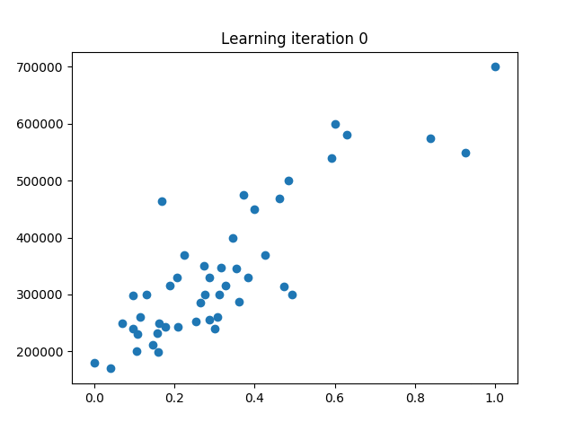

# Multivariate linear regression



The gradient descent equation used for implementation:


where:

 - `θj` - parameters vector which should be find!! Why we actually here 😃
 - `x` - our features vector
 - `y` - actual result values (e.g. labels)
 - `α` - learning step
 - `hθ` - hypothesis function or:
  
     - 

With Python and Numpy it can be written this way:
```python
theta = theta - alpha * 1 / m * X.T @ (X @ theta - y)
```
where:
- `@` - matrix multiplication operation
- `.T` - property returning the transposed matrix